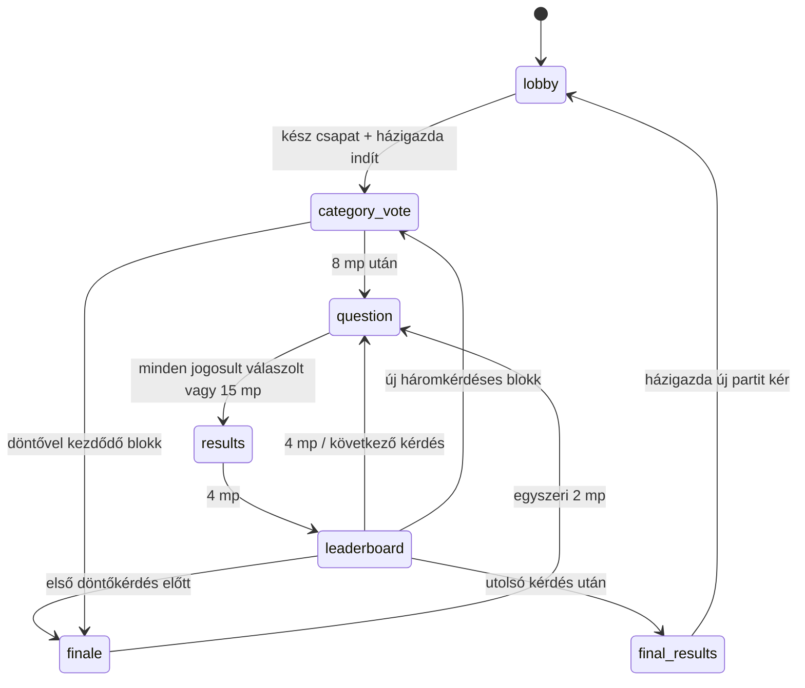

# Észvesztő – játéktervezési szerződés

## Jóváhagyott termékdöntések

- Magyar nyelvű, böngészős kvízparti 2–8 játékosnak, privát szobakóddal.
- 6, 12 vagy 18 közös kérdés, alapérték 12. Könnyed, Normál (alapérték), Nehéz.
- Háromkérdéses blokkonként három felkínált kategória közös szavazással.
- Minden kérdés után eredmény és ranglista. A végén dupla pontos döntő és végső győztesek.
- Nyolc kizárólag kozmetikai karakter: Maffiamacska, Rövidzárlat, Professzor Káosz, Züm, Krumplibáró, Paca, Galambkirály, Csonti. Azonos karaktert többen is választhatnak.
- Játékidőn kívül összeállított kérdésbank; nincs élő AI, külső trivia-API vagy fizetős tartalomszolgáltatás.
- Későbbi szabotázsrendszer: kérdésenként egy ingyenes képesség három véletlen ajánlatból, másik játékos célzása, öncélzás tilos. Több támadás korlátozott összhatása megválaszolhatóvá hagyja a kérdést; semelyik elfogadott támadás nem tűnhet el csendben. Nincs bolt vagy fizetőeszköz.

## PR #2: ténylegesen megvalósult

Teljes kvíz, a korábbi élő előszoba és jogosultságok megtartásával. Szabotázs **még nincs megvalósítva**; a szavazás közvetlenül kérdésre vált. A `sabotage-selection` és `target-selection` megosztott típusok fenntartottak, nincs működés nélküli várakozás vagy gomb. A korábbi `session` típus csak régi tárolt adat kompatibilitásához marad meg.

Az inicializálás a szerver indítási tranzakciójában hozza létre a munkamenetet; nincs üres inicializáló képernyő. A harmadik/százalékos döntőhatár miatt a döntő indulhat blokk közben (6 kérdés: 5.; 18 kérdés: 15.) vagy szavazás után (12 kérdés: 10.). Minden állapot és lezárt eredmény tartósan mentett.

## E PR-ban kiválasztott technikai alapértékek

Ezek működő implementációs döntések, későbbi termékhangolással változhatnak:

| Fázis/szabály                         | Alapérték                           |
| ------------------------------------- | ----------------------------------- |
| Kategóriaszavazás                     | 8 mp, egy módosítható szavazat      |
| Kérdés                                | 15 mp, egy zárolt válasz            |
| Eredmény                              | 4 mp                                |
| Ranglista                             | 4 mp                                |
| Döntő bejelentése                     | egyszer 2 mp                        |
| Döntő hossza 6 / 12 / 18 kérdésnél    | 2 / 3 / 4 kérdés                    |
| Helyes válasz                         | 100 + 0–50 gyorsasági pont          |
| Hibás/kihagyott/határidőn túli válasz | 0 pont                              |
| Döntő szorzó                          | 2 az alappont és a bónusz összegére |

Szavazásnál a legtöbb szavazat nyer; döntetlennél a holtversenyben állók, szavazat nélkül mindhárom ajánlat közül egyenletes kriptográfiai véletlen választ. Szavazatok játékos-ID szerint felülíródnak, nem összeadódnak. Összesített szavazatszám a határidő után nyilvános, a saját választás közben is látható. A nyertes téma a következő három kérdésre érvényes. Új ajánlat előnyben, ismétlés csak szükség esetén. Ajánlathoz legalább három még nem használt publikált kérdés szükséges.

Gyorsaság: `e = floor((szerver_beérkezés − kérdéskezdés) / 1000)`; `b = floor(50 × max(0, 14 − e) / 14)`; helyes pont `(100 + b) × szorzó`. Az első 1 mp 50, az utolsó 1 mp 0 bónuszt ad, a határidő kizáró. A szerver átvételi ideje számít, kliensóra nem; hálózati késéshez nincs rejtett kompenzáció. A kliens óraeltérés-becslést és ping/pongot használ a kijelzéshez, nem pontozáshoz.

Pontszámok halmozódnak, döntő előtt nincs nullázás. Egy kör lezárása egyszer ad jutalmat; munkamenet-, kör- és fázisazonosító köt minden szavazatot/választ az aktuális állapothoz. Ugyanazon kérés ismétlése visszaigazolható; új kérés-ID sem nyitja fel a már rögzített választ.

## Tartalom és mintavétel

120 magyar, négyválaszos szöveges kérdés, 12 kategóriában, kategóriánként 3 könnyű, 4 közepes, 3 nehéz. A bank a szervercsomag része. Stabil ID, típus, kategória, nehézség, szöveg, opciók, megoldókulcs, magyarázat, `published` állapot és strukturális ellenőrzési/provenienciajelölés. Az importáláskori validálás hibás struktúránál megállítja a build/futtatást.

Célminták három kérdésenként: Könnyed = könnyű/könnyű/közepes; Nehéz = közepes/nehéz/nehéz; Normál az első félidőben könnyű/közepes/nehéz, a másodikban közepes/nehéz/nehéz. A 18 kérdéses Normál első fele kilenc kérdés, nem egy teljes félidőre kerekített blokkszám. A mintavétel kategorikus marad, nincs csendes témacsere.

Először a partiban még nem használt, előző partikból megjegyzett legfeljebb 60 ID-n kívüli készlet, ha létezik; utána a kért nehézség. Hiányzó szint determinisztikus helyettesítési sorrendje: könnyű → közepes → nehéz; közepes → könnyű → nehéz; nehéz → közepes → könnyű. Az adott szinten véletlen választás. Ha minden elérhető kérdés korábbi partiból ismert, ismét használható, de **ugyanazon partin belül soha nincs ismétlődő ID**. Az új kérdések előnyben részesítése ezért felülírhatja az ideális nehézségi arányt.

Kezdő készlet: általános, többnyire állandó tények, automatikus szerkezeti ellenőrzéssel. **Nem volt független emberi audit vagy empirikus nehézségkalibráció.** A témánkénti forrásmutatók szerkesztői kiindulópontok, nem minden állítás ellenőrzött idézetei. A review értéke `automated-structure-only`. A „published” a játékba engedett struktúrát jelenti, nem emberi tanúsítást. Tételes forrásellenőrzés, szerkesztés és játékosokkal mért besorolás szükséges a tartalom következő fejlesztéséhez.

A megosztott modell megőrzi az igaz/hamis és képes kérdéseket; a motor kétopciós igaz/hamis projekcióra és képmetaadatra felkészített. A publikált tartalomkapu jelenleg csak négyopciós szöveges típust fogad. Képes tartalom jóváhagyott saját assetekig zárt; nincs külső képletöltés vagy előállított karakterkép.

## Eredmények és rangsorolás

Eredményképernyő: helyes válasz, saját választás/kihagyás, alappont, bónusz, szorzó, valódi körpont, magyarázat. A következő ranglista összpontokat, karaktert, becenevet, saját kiemelést és valódi helyezésváltozást mutat. Kérdés alatt nincs teljes ranglista.

Azonos pontszámhoz azonos versenyhelyezés tartozik (1., 1., 3.). Stabil megjelenítési sorrend: pontszám csökkenően, belépési idő, ID. A végén minden első helyezett győztes. Pontosság helyes / összes kérdés, tehát kihagyott kérdés is a nevező része. Átlagos válaszidő csak tényleges, határidőn belüli válaszokból; hibás válasz is beleszámít. Nem készítünk hamis statisztikát.

## Megbízhatóság és aktív részvételi szabály

Egy Durable Object vezérli a szobát, sorosított tranzakciókkal és tartós határidőkkel. A legközelebbi játék-, heartbeat-, türelmi- vagy lejárati határidőre egy közös alarm figyel. Késői alarm az eredeti határidők mentén léptet több fázist; nem indít újra időzítőt és nem jutalmaz kétszer. A parti zárt böngészők mellett is befejeződik.

Frissítés helyreállítja az aktuális fázist, hátralévő időt, saját zárolt választ és pontszámot. Nyilvános projekcióban nincs megoldókulcs a lezárás előtt, nincs más játékos választása, belső válaszidő vagy kérdésbank-metaadat. A szerver kapcsolatonként készít biztonságos, saját választást tartalmazó projekciót. A kliens nem dönt átmenetről vagy pontozásról.

Az előszobában változatlan 90 másodperces türelmi idő és eltávolítás. Aktív játékban a régi identitás és eredménye megmarad a szobakor végéig: 90 másodperc után házigazdaátadás történhet, a játékos nem blokkolja a korai lezárást, de visszatérhet. Az aktuális, még megválaszolatlan kérdésre időben visszatérve válaszolhat, már mentett választ nem módosíthat. Egy offline játékos sem fagyasztja meg a 15 másodperces határidőt.

Kifejezett kilépő történeti pontjai/rangsora megmaradnak, visszalépési jogosultsága megszűnik. Új parti csak a végeredmény után, házigazdai műveletből: előszoba, új készenlét; az új indítás új munkamenet. Karakter és beállítás marad, pont és válasz törlődik. Türelmi időn túl továbbra is offline helyek új partinál felszabadulnak. Új játékos csak előszobában csatlakozhat.

## Cloudflare kompatibilitás és ismert korlátok

Worker név/bindings/SQLite `v1` változatlan. A `room` rekord additív `schemaVersion: 2` bővítést kap. Régi előszoba megmarad, az első PR régi kérdés nélküli `session` egyszer visszatér előszobába magyar tájékoztatóval és törölt készenléttel; belépési titok hash, karakter és beállítás megmarad. Nincs destruktív adat- vagy infrastruktúra-migráció. Tartalomkiadáskor stabil ID-k megőrzése szükséges aktív partira hivatkozó tartalomhoz.

Ismert korlátok: kis kezdő bank, előzetes nehézségcímkék, témánkénti forrásmutatók, hálózati késés hatása, mobil háttérbe kerülés miatti kapcsolatvesztés, eredethez kötött böngészőtár, Cloudflare szolgáltatási kvóták. A korábbi 2 órás tétlenség és 24 órás szobakor továbbra is érvényes. Teszt és deploy dry run helyi; éles Cloudflare-telepítést ez a PR nem végez.

## PR #3 ajánlott tartalma

Valódi szerveroldali szabotázsválasztás és célzás. Összhatás felső korlátja, minden támadás elszámolása, megválaszolható/olvasható mobilkérdés és megfelelő visszajelzés. Ötletek: fagyasztás, nyálkabomba, válaszkeverés, fejjel lefelé válaszok, tintapaca, válaszrulett; konkrét hatások és kombinációs korlátok még véglegesítendők. Többjátékos, stale-phase, reconnect és akadálymentességi tesztek szükségesek. Nem része bolt, pénznem, fiók vagy fizetős szolgáltatás.
