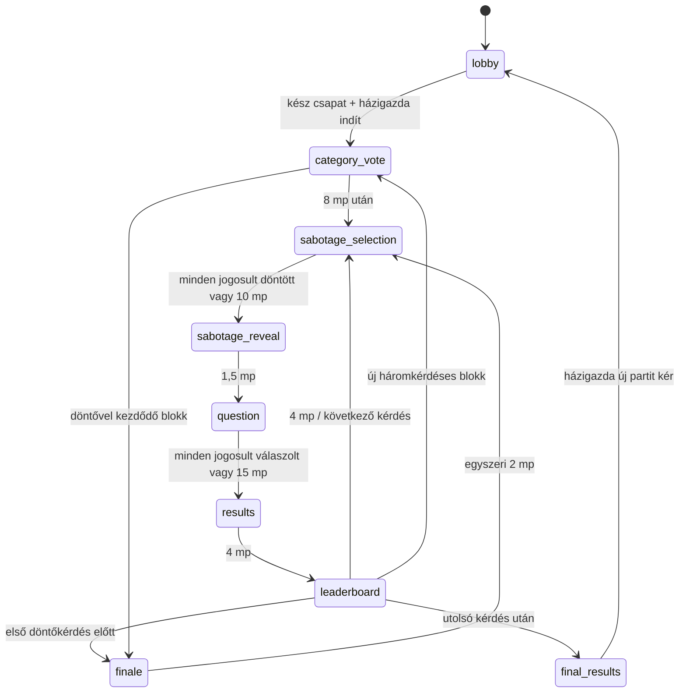

# Észvesztő – játéktervezési szerződés

## Jóváhagyott termékdöntések

- Magyar nyelvű, böngészős kvízparti 2–8 játékosnak, privát szobakóddal.
- 6, 12 vagy 18 közös kérdés, alapérték 12. Könnyed, Normál (alapérték), Nehéz.
- Háromkérdéses blokkonként három felkínált kategória közös szavazással.
- Minden kérdés után eredmény és ranglista. A végén dupla pontos döntő és végső győztesek.
- Nyolc kizárólag kozmetikai karakter: Maffiamacska, Rövidzárlat, Professzor Káosz, Züm, Krumplibáró, Paca, Galambkirály, Csonti. Azonos karaktert többen is választhatnak.
- Játékidőn kívül összeállított kérdésbank; nincs élő AI, külső trivia-API vagy fizetős tartalomszolgáltatás.
- Megvalósult szabotázsrendszer: kérdésenként egy ingyenes képesség három véletlen ajánlatból, másik játékos célzása, öncélzás tilos. Több támadás korlátozott összhatása megválaszolhatóvá hagyja a kérdést; semelyik elfogadott támadás nem tűnhet el csendben. Nincs bolt vagy fizetőeszköz.

## PR #3: ténylegesen megvalósult

Teljes szabotázs a korábbi élő előszoba, kvíz és jogosultságok megtartásával. Minden kérdés előtt három saját ajánlat, egy ingyenes támadás vagy kihagyás. A `target-selection` fenntartott protokolltípus továbbra sem külön globális fázis: a célzás a `sabotage-selection` helyi második lépése. A korábbi `session` csak régi tárolt adat kompatibilitásához marad meg.

Az inicializálás a szerver indítási tranzakciójában hozza létre a munkamenetet; nincs üres inicializáló képernyő. Az eltérő döntőhatárok miatt a döntő indulhat blokk közben (6 kérdés: 5.; 18 kérdés: 15.) vagy szavazás után (12 kérdés: 10.). Minden állapot és lezárt eredmény tartósan mentett.

## E PR-ban kiválasztott technikai alapértékek

Ezek működő implementációs döntések, későbbi termékhangolással változhatnak:

| Fázis/szabály                         | Alapérték                            |
| ------------------------------------- | ------------------------------------ |
| Kategóriaszavazás                     | 8 mp, egy módosítható szavazat       |
| Szabotázsválasztás + célzás           | közös 10 mp, egyszeri döntés         |
| Támadásbemutató                       | 1,5 mp, nincs jóváhagyó gomb         |
| Kérdés                                | 15 mp, normál: egy; döntő: több tipp |
| Eredmény                              | 4 mp                                 |
| Ranglista                             | 4 mp                                 |
| Döntő bejelentése                     | egyszer 2 mp                         |
| Döntő hossza 6 / 12 / 18 kérdésnél    | 2 / 3 / 4 kérdés                     |
| Helyes válasz                         | 100 + 0–50 gyorsasági pont           |
| Hibás/kihagyott/határidőn túli válasz | 0 pont                               |
| Döntő szorzó                          | 2 az alappont és a bónusz összegére  |

Szavazásnál a legtöbb szavazat nyer; döntetlennél a holtversenyben állók, szavazat nélkül mindhárom ajánlat közül egyenletes kriptográfiai véletlen választ. Szavazatok játékos-ID szerint felülíródnak, nem összeadódnak. Összesített szavazatszám a határidő után nyilvános, a saját választás közben is látható. A nyertes téma a következő három kérdésre érvényes. Új ajánlat előnyben, ismétlés csak szükség esetén. Ajánlathoz legalább három még nem használt publikált kérdés szükséges.

Gyorsaság: `e = floor((szerver_beérkezés − kérdéskezdés) / 1000)`; `b = floor(50 × max(0, 14 − e) / 14)`; normál helyes pont `100 + b`; döntő: `(100 − 30 × hibás tippek + b) × 2`. A döntő gyorsasági ideje az első helyes tipp fogadása. Az első 1 mp 50, az utolsó 1 mp 0 bónuszt ad, a határidő kizáró. A szerver átvételi ideje számít, kliensóra nem; hálózati késéshez nincs rejtett kompenzáció. A kliens óraeltérés-becslést és ping/pongot használ a kijelzéshez, nem pontozáshoz.

Pontszámok halmozódnak, döntő előtt nincs nullázás. Egy kör lezárása egyszer ad jutalmat; munkamenet-, kör- és fázisazonosító köt minden szavazatot/választ az aktuális állapothoz. Ugyanazon kérés ismétlése visszaigazolható; új kérés-ID sem nyitja fel a már rögzített választ.

## A hat szabotázs és pontos alapértékei

A központi regiszter `src/shared/sabotage.ts`; az összevonás `src/server/sabotage.ts`. Az alábbiak megvalósult, kezdeti hangolási értékek, játékosokkal még nem kalibrált végleges szabályok.

| Stabil ID / magyar név         | Mechanika                                                                                                                                                | Több azonos támadás                                                         |
| ------------------------------ | -------------------------------------------------------------------------------------------------------------------------------------------------------- | --------------------------------------------------------------------------- |
| `slime` / Takonybomba          | Organikus zöld foltok a kérdés/válaszok kis részein. Valódi ujj-/egérsöprés törli a vászonmaszkot; foltonként több söprés vagy négy akadálymentes lépés. | `min(3, 1 + ceil(támadásszám / 2))` folt; egy támadás 2 folt.               |
| `freeze` / Fagyasztás          | Feltörhető jégbarrier: 1/2/3+ támadásra 3/4/5 elfogadott koppintás. Korai feloldás szerveren is.                                                         | 1/2/3/4+ támadás: 1200/1600/1800/2000 ms.                                   |
| `shuffle` / Káosz              | Tényleges, célpontspecifikus helycsere a megjelent válaszokon 650 ms-nél; 200 ms rendeződési jelzés.                                                     | 2+ támadásnál még egy helycsere 1250 ms-nél. Zár feloldása 850/1450 ms-nél. |
| `upside-down` / Feje tetejére! | Csak a válaszszöveg fordul 180°-kal; kérdés, gombhely, időmérő és navigáció nem. Automatikusan visszaáll.                                                | 3000 ms + 500 ms minden további támadásra, maximum 4000 ms.                 |
| `ink` / Tintapaca              | Sötét csillagszerű tinta: legalább 16 px-es rövid söprés vagy két koppintás/kattintás/Enter. Első megnyomás halványít, második eltüntet.                 | Ugyanaz a foltszámképlet, maximum 3 tintafolt.                              |
| `roulette` / Válaszrulett      | A válaszok 2000 ms alatt négyszer helyet cserélnek; a körforgás végén stabilak. Beküldés addig tiltott.                                                  | 2+ támadásnál öt helycsere, nem hosszabb idő.                               |

A kérdés saját kezdeti válaszkeverése közös és külön történik. A szabotázs a kérdés megjelenése után módosítja a célpont sorrendjét. A szerver előre mentett, megoldókulcstól független, nem nulla eltolású válaszindex-permutációkat és abszolút időket küld. A React-gomb kulcsa és beküldött indexe végig ugyanaz a kanonikus identitás; a betűjel is ehhez kötődik. A helycserék alatt a kliens `aria-disabled` állapotot és megnyomáskor visszajelzést ad, a szerver pedig `ANSWERS_MOVING` hibával tiltja a túl korai választ. Nincs véletlenül másik válasszá változó beküldés. A feloldás pillanatára stabil az elrendezés.

### Korlátozott összevonás, minden támadás elszámolva

Minden elfogadott támadás megőrzi a támadó ID-ját, képességét, célpontját és feloldási eredményét. A célpontonkénti összesítés nem dob el és nem irányít át támadást. Típusonként csökkenő hozadék és szigorú felső korlát érvényes; a fölös mechanikai erő helyett a valós szám és teljes támadáslista marad a társas visszajelzésben.

1. Fagyasztás és mozgás párhuzamosan indul a kérdés kezdetén. Feltörés nélkül a közös beküldési zár `max(fagyasztás, mozgás)`, **maximum 2000 ms**, nem ezek összege. Három Fagyasztás + két Rulett így 2 mp zár, nem 5,8 mp.
2. Káosz + Rulett együtt csak a Rulett legfeljebb öt helycseréjét futtatja; a Káosz egy további permutációval járul hozzá az utolsó, közös képkocka végső sorrendjéhez. Nem hosszabbítja a zárolást és nem indít külön mozgási sorozatot.
3. A közös zár végétől fordul fejre az esetleges válaszszöveg, legfeljebb 4 mp-ig. Közben már lehet válaszolni.
4. Ezután jelennek meg együtt a takony- és tintafoltok. Eltávolíthatók, és **4500 ms után automatikusan eltűnnek**. Közben is lehet válaszolni. A foltok legfeljebb 20% szélesek, takony 18%, tinta 16% magas; típusonként maximum három. Összes névleges befoglaló terület maximum 20,4%. A legalább 44 px-es érintési felület és legalább 280 px magas választerület a támogatott 320 px-es nézeten is a 25%-os kereten belül marad. Nem fedik le az összes választ vagy a teljes kérdést.

Legrosszabb vegyes ütemezésben az akadályok a normál 15 mp-ből legkésőbb 10,5 mp-nél elmúlnak; a beküldés legfeljebb az első 2 mp-ben tiltott. Hét támadás ugyanarra a játékosra mind megjelenik a nyilvántartásban. A határon túl érkező további támadás nem növeli a zárat, a foltszámot, a mozgásszámot vagy a fejre állítás idejét.

### Ajánlat, célzás és szerver-visszaigazolás

A szerver kriptográfiai véletlennel választ három egyedi képességet a hatból minden megmaradt résztvevőnek, minden kérdésre. Az ajánlat a kérdés kiválasztásával együtt mentett; újracsatlakozás ugyanazt kapja. Kizárólag a saját ajánlat és saját elkötelezett művelet látható választás közben. Más játékosról csak a döntés megléte nyilvános; képessége/célpontja a feloldás előtt nem.

Mobilon három nagy, eltérő színű/ikonú kártya → egy választott képesség és karakteres ellenfélrács → ellenfélre koppintás. A vissza gomb a végleges beküldés előtt enged másik képességet. A szerverállapot és a kérés visszaigazolása után jelenik meg a rögzített támadás; hiba esetén magyar üzenet és új célzási lehetőség marad. Nincs külön jóváhagyó párbeszéd. A kihagyás explicit művelet; aki 10 mp alatt nem dönt, időtúllépéses kihagyást kap. A fázis elején még türelmi időn belüli jogosultak mindegyikének döntése után a szerver korábban feloldhat; később visszatérő résztvevő addig választhat, amíg a fázis még tart. A döntő minden kérdéséhez ugyanez tartozik, egyszeri döntőbejelentés után.

Atomikus WebSocket-művelet: `attack {requestId, sessionId, phaseId, round, abilityId, targetId}` vagy `skip-attack {requestId, sessionId, phaseId, round}`. Hitelesített kapcsolati identitás, aktív résztvevő, munkamenet, fázis, kör, szerverhatáridő, saját ajánlat, másik érvényes célpont és egyetlen elkötelezett művelet kötelező. Runtime-validálás ismeretlen képességre/hibás célpont-ID-ra hibát ad. A meglévő, játékosonkénti mentett kérés-ID deduplikáció visszaigazolhatja az eredeti sikeres kérést; új ID sem enged második támadást. Mentés megelőzi a broadcastot és ACK-ot.

A feloldás egyszer fut (`resolved`), majd 1,5 mp bemutató következik kötelező kattintás nélkül. Nincs bejövő támadás: nyugodt üzenet; egy: konkrét képesség; több: valós darabszám. A kérdés kis összesítést mutat, az eredmény lenyitható részleteiben minden támadó/képesség és a saját elküldött támadás szerepel. Nincs hamis vagy eltúlozott támadásszám.

### Reconnect, kilépés és adatvédelem

Mentett: ajánlatok, elkötelezett támadás/kihagyás, jogosultsági pillanatkép, célpontok, minden támadásrekord, egyszeri feloldás jelzője, típusonkénti számok, képkockák és abszolút hatás-határidők. Ezek rekonstrukciókor nem generálódnak újra. A fagyasztás a szerver kérdéskezdésétől számít, kliensidő nem fogadható el. `FROZEN` visszautasítás nem rögzít választ, nem hosszabbítja a kérdést, nem módosít pontot. A már elfogadott válasz frissítéskor is zárolt.

Rövid ideig offline ellenfél célpont lehet. A 90 mp türelmi időn túli vagy kifejezetten kilépett ellenfél új támadás célpontja nem lehet. Már rögzített támadás célpontjának átmeneti kapcsolatvesztése nem törli/irányítja át azt, határideje offline is fut. A feloldás előtt kifejezetten kilépett célpont támadása `target-left` eredménnyel megmarad, mechanikai hatás nélkül. Feloldás után kilépés nem írja át a történeti feloldást. A támadó utólagos kapcsolatvesztése vagy kilépése nem vonja vissza a rögzített támadást. Korábbi pontok és rangsor a meglévő szabály szerint maradnak. Új parti törli az egész kvízzel együtt az összes ideiglenes szabotázst; új session/phase védi a visszajátszás ellen.

A folttörlés vizuális előrehaladása ugyanazon böngésző helyi tárában, játékos/fázis szerint mentett; más eszközre nem szinkronizált és tiltott tárnál csak az aktuális nézetben őrizhető meg. Az abszolút lejárat akkor sem indul újra. A szerver hiteles játékszabályt és zárolást biztosít, a kliens vizuális hatását nem állítjuk manipulálhatatlannak.

Csak saját hatásütemezés és a már feloldott saját bejövő/kimenő támadások kerülnek a néző projekciójába. Reconnect-titok, hash, más ajánlat, más elkötelezett művelet, teljes bank és idő előtt megoldókulcs nem. A hatáspermutáció nem tartalmaz helyességi adatot; rejtett HTML-attribútum sem tartalmaz megoldást.

## Tartalom és mintavétel

312 magyar, négyválaszos szöveges kérdés, a meglévő 12 kategóriában, kategóriánként 26; mindhárom szinten legalább 5. Az eredeti 120 ID és helyes válasz megmaradt, 192 új kérdés kategóriamodulokba szervezve. A bank a szervercsomag része. Stabil ID, típus, kategória, nehézség, szöveg, opciók, megoldókulcs, magyarázat, `published` állapot és strukturális ellenőrzési/provenienciajelölés. Az importáláskori validálás hibás struktúránál megállítja a build/futtatást.

Célminták három kérdésenként: Könnyed = könnyű/könnyű/közepes; Nehéz = közepes/nehéz/nehéz; Normál az első félidőben könnyű/közepes/nehéz, a másodikban közepes/nehéz/nehéz. A 18 kérdéses Normál első fele kilenc kérdés, nem egy teljes félidőre kerekített blokkszám. A mintavétel kategorikus marad, nincs csendes témacsere.

Először a partiban még nem használt, előző partikból megjegyzett legfeljebb 180 ID-n kívüli készlet, ha létezik; utána a kért nehézség. Hiányzó szint determinisztikus helyettesítési sorrendje: könnyű → közepes → nehéz; közepes → könnyű → nehéz; nehéz → közepes → könnyű. Az adott szinten véletlen választás. Ha minden elérhető kérdés korábbi partiból ismert, ismét használható, de **ugyanazon partin belül soha nincs ismétlődő ID**. Az új kérdések előnyben részesítése ezért felülírhatja az ideális nehézségi arányt.

Kezdő készlet: általános, többnyire állandó tények, automatikus szerkezeti ellenőrzéssel. **Nem volt független emberi audit vagy empirikus nehézségkalibráció.** A témánkénti forrásmutatók szerkesztői kiindulópontok, nem minden állítás ellenőrzött idézetei. A PR #4-ben modell által szerkesztett/auditált bank review értéke `model-audited`; 11 ténylegesen lekért forrásrészlettel összevetett megoldásnál `source-checked-answer`, rövid bizonyítékkal és rögzített forrásverzióval. A témamutató önmagában nem ellenőrzött hivatkozás. [Tételes audit és eloszlás](content-review.md). A „published” a játékba engedett struktúrát jelenti, nem emberi tanúsítást. Tételes forrásellenőrzés, szerkesztés és játékosokkal mért besorolás szükséges a tartalom következő fejlesztéséhez.

A megosztott modell megőrzi az igaz/hamis és képes kérdéseket; a motor kétopciós igaz/hamis projekcióra és képmetaadatra felkészített. A publikált tartalomkapu jelenleg csak négyopciós szöveges típust fogad. Képes tartalom jóváhagyott saját assetekig zárt; nincs külső képletöltés vagy előállított karakterkép.

## Eredmények és rangsorolás

Eredményképernyő: helyes válasz, saját választás/kihagyás, alappont, bónusz, szorzó, valódi körpont, magyarázat. A következő ranglista összpontokat, karaktert, becenevet, saját kiemelést és valódi helyezésváltozást mutat. Kérdés alatt nincs teljes ranglista.

Azonos pontszámhoz azonos versenyhelyezés tartozik (1., 1., 3.). Stabil megjelenítési sorrend: pontszám csökkenően, belépési idő, ID. A végén minden első helyezett győztes. Pontosság helyes / összes kérdés, tehát kihagyott kérdés is a nevező része. Átlagos válaszidő csak tényleges, határidőn belüli válaszokból; hibás válasz is beleszámít. Nem készítünk hamis statisztikát.

## Megbízhatóság és aktív részvételi szabály

Egy Durable Object vezérli a szobát, sorosított tranzakciókkal és tartós határidőkkel. A legközelebbi játék-, heartbeat-, türelmi- vagy lejárati határidőre egy közös alarm figyel. Késői alarm az eredeti határidők mentén léptet több fázist; nem indít újra időzítőt és nem jutalmaz kétszer. A parti zárt böngészők mellett is befejeződik.

Frissítés helyreállítja az aktuális fázist, hátralévő időt, saját zárolt választ és pontszámot. Nyilvános projekcióban nincs megoldókulcs a lezárás előtt, nincs más játékos választása, belső válaszidő vagy kérdésbank-metaadat. A szerver kapcsolatonként készít biztonságos, saját választást tartalmazó projekciót. A kliens nem dönt átmenetről vagy pontozásról.

Az előszobában változatlan 90 másodperces türelmi idő és eltávolítás. Aktív játékban a régi identitás és eredménye megmarad a szobakor végéig: 90 másodperc után házigazdaátadás történhet, a játékos nem blokkolja a korai lezárást, de visszatérhet. Az aktuális, még megválaszolatlan kérdésre időben visszatérve válaszolhat, már mentett választ nem módosíthat. Egy offline játékos sem fagyasztja meg a 15 másodperces határidőt.

Kifejezett kilépő történeti pontjai/rangsora megmaradnak, visszalépési jogosultsága megszűnik. Új parti csak a végeredmény után, házigazdai műveletből: előszoba, új készenlét; az új indítás új munkamenet. Karakter és beállítás marad, pont és válasz törlődik. Türelmi időn túl továbbra is offline helyek új partinál felszabadulnak. Új játékos csak előszobában csatlakozhat.

## Cloudflare kompatibilitás és ismert korlátok

Worker név/éles bindings/SQLite `v1` változatlan. A `room` rekord additív `schemaVersion: 4` bővítést kap. A PR #5 mezői és a már előkészített döntőkérdés átmeneti egyválaszos szabálya lent dokumentáltak; identitás/pont/határidő nem nullázódik. A 2-es séma előszobája és aktív kvíze, identitásai, beállításai, pontjai, kérdésfolyamata, válaszai, fázisazonosítója és határideje megmaradnak; hiányzó `sabotage` mező `null`. Futó régi kérdésre nem alkalmazunk utólag új hatást, a következő kérdés már szabotázzsal kezdődik. Régi előszoba megmarad, az első PR régi kérdés nélküli `session` egyszer visszatér előszobába magyar tájékoztatóval és törölt készenléttel; belépési titok hash, karakter és beállítás megmarad. Nincs destruktív adat- vagy infrastruktúra-migráció. Tartalomkiadáskor stabil ID-k megőrzése szükséges aktív partira hivatkozó tartalomhoz.

A feature ág Workers Builds folyamata `wrangler preview` parancsot futtat. Ehhez a `previews.durable_objects.bindings` újra deklarálja az `env.ROOMS` bindingot helyi `Room` osztállyal, külső `script_name` nélkül: a Cloudflare automatikusan külön névteret és tárolást ad preview-nként. A `previews.ratelimits` ugyanazt a 60 kérés / 60 mp korlátot a külön `1002` névtérben használja, az éles `1001` változatlan. A preview-k rate-limit névtere közös, az éles forgalomtól elkülönített. Az assetek és a meglévő migráció öröklődnek a felső szintről. Ez az előnézeti build konfigurációja, nem éles telepítés. [Cloudflare izolációs szabályok](https://developers.cloudflare.com/workers/previews/resources/#durable-objects).

Ismert korlátok: részben forrásellenőrzött bank, előzetes nehézségcímkék, sok kérdésnél csak témaköri forrásmutatók, hálózati késés hatása, mobil háttérbe kerülés miatti kapcsolatvesztés, eredethez kötött böngészőtár, Cloudflare szolgáltatási kvóták. A korábbi 2 órás tétlenség és 24 órás szobakor továbbra is érvényes. Teszt és deploy dry run helyi; éles Cloudflare-telepítést ez a PR nem végez.

## Mobil, hozzáférhetőség és ellenőrzés

320/375/390/430 px és asztali nézet; legalább 44 px érintési célok, safe-area margók, tördelődő becenevek. Kis helyen hosszú szöveg/célpontrács görgethető, nem levágott. Egyetlen meglévő játékóra rajzolja a visszaszámlálást és a határidős hatásokat; nincsenek hatásonként új intervallumok vagy nehéz canvas/animációs csomagok. CSS/SVG, könnyű natív vászonmaszk és gombok. Billentyűzetes törlés és két megnyomás a tinta söprésének alternatívája. `prefers-reduced-motion` kikapcsolja az erős animációt; azonos helycserék, időzárak, rövid fejre állítás és törlési feladat marad. Nincs villogás; szöveg/ikon jelzi az állapotot, nem csak szín.

PR #3: 85 sikeres Vitest szabály- és valódi Workers-teszt; az előző tesztek megmaradtak. Ajánlatok/privát projekció, atomikus validálás, kihagyás/időtúllépés, stale phase/session/round, 2/4/8 résztvevő, hét elfogadott támadás ugyanarra a játékosra, mind a hat mechanika, csökkenő hozadék és korlátok, helyes válaszindex, szerveroldali fagyasztás, disconnect/kilépés, tárolási upgrade, rekonstrukció, késői alarm, pontozás, döntő és új parti.

A nyolcklienses Workers-teszt valódi HTTP/WS belépéssel, támadás/ACK újraküldéssel, reconnecttel és Durable Object rekonstrukcióval mind a hat típust célozza egy játékosra. A teszt saját tárolt fixture-jében rögzített ajánlatok és határidők vannak, nincs éles tesztkapu vagy hamis eredmény. A szerver visszautasítja a fagyott választ, majd mind a nyolc résztvevő helyes választ ad és valódi pontot kap.

Három sikeres Chromium-teszt: előszoba/jogosultságok, főoldal, továbbá két független érintéses mobilkliens hat valódi kérdéssel. Utóbbi választ/céloz, ténylegesen kiosztott hatásokat kezel, helyes pontszámot és indexet ellenőriz, ajánlat/támadás/folttörlés/válasz közben frissít, egyszeri döntőt és új partit vizsgál. Az egyik kliens csökkentett mozgású. A véletlen ajánlatokat nem cseréli le a browserteszt; minden képesség determinisztikus szabálytesztben is lefedett. Keskeny mobilképek a teszt artifactjaiban. ESLint, TypeScript, build, E2E és Wrangler deploy dry run eredménye a PR leírásában; helyi Workers-validálás nem bizonyít éles deployt vagy valós telefonon végzett emberi tesztet.

## PR #4: megjelenítési keményítés

A játékhurok, összes fázishatáridő, szabotázsérték, kanonikus válaszindex és pontozás változatlan. A tárolási séma 3 marad: nincs új szerveres mező. A tartalmi szétválasztás stabil numerikus ID-kat használ, nem tömbpozícióból képzett új azonosítókat. A régi 120 megoldásszöveg megőrzését külön SHA-256 alapállapot-teszt ellenőrzi. Futó régi kérdés mentett opciósorrendje/megoldóindexe marad, a hét nyelvi pontosítás ugyanazt a tényt kérdezi. Egy már futó régi round nem kap új keverést. A rematch meglévő történetmezője az új rematch művelettől 180 elemre korlátozott; tárolási migráció nélkül kompatibilis a régi rövidebb listával.

### Görgetési szerződés

A `GameView` életciklusa a html/body `data-gameplay` jelölőjével rögzíti a dokumentumot és kezdetben nullára állítja a dokumentumeltolást. A hook az előző jelölőértékeket visszaállítja; inline stílust nem ír felül. Aktív fázis, végső eredmény és átmeneti reconnect alatt egyaránt aktív. Előszoba/rematch, főoldal, űrlap, lejárt/átvett kapcsolat és unmount feloldja. A korábbi oldal függőleges pozícióját nem állítja vissza.

A nézet `100dvh`, régi böngészőn `100vh`, safe-area margókkal. Fejléc/állapot/kilépés fix flexsáv, a fáziskártya `min-height:0` és szándékos `overflow-y:auto` panel. Hosszú szöveg, hét célpont, nyolc soros ranglista, rövid/fekvő képernyő és megnövelt szöveg ezen belül görgethető; nem vágjuk le a vezérlőket. Sticky fázisadat/idő, fókuszálható panel, görgetési fókuszmargó. `overscroll-behavior` a támogatott böngészőkben megakadályozza a görgetési láncolást. A panel engedi a függőleges érintést és a pinch zoomot; a meglévő tinta saját gesztusfelülete működik. Nincs globális `touch-action:none`, zoomtiltás vagy szövegkijelölés-tiltás. Fázis-ID váltáskor a panel görgetése és rövid belépési animációja újraindul, ismételt snapshotnál nem.

### Képi és hangos visszajelzés

Nyolc változatlan kozmetikai karakter egy újrafelhasználható `CharacterPortrait` komponenst használ minden releváns képernyőn. Saját SVG keret, szín, karakterenkénti részletjel és eddigi emoji. Nem készült prémium figuracsomag vagy bináris kép; a komponens a későbbi jóváhagyott assetek cserefelülete. Kész/kiemelt állapot, rövid fázisbelépés, rögzített saját válasz, lezárt körpont, valós rangjavulás, döntő és győzelem kap könnyű CSS-visszajelzést. Nincs hamis helyezés, új fázis vagy mozgásból fakadó extra választiltás. Csökkentett mozgásnál az új animációk megszűnnek.

Egy központi, opcionális Web Audio backend saját, szerény szinuszos motívumokkal (hangcsúcs 0,035). Egy motívum egyszerre; legfeljebb négy hang, 85 ms lépésekkel, hangonként 140 ms. Dekoratív koppintások 140 ms korláttal és a szerver-visszajelzés idején elnyomva. A hangkörnyezet csak trusted pointer/Enter/Space gesztusra jön létre/éled fel. Rejtett lap leállítja és felfüggeszti, új gesztus kell. A Hang/Néma gomb minden képernyő fejlécében látszik, némítás ugyanazon eredet localStorage értékében mentett (tártiltásnál oldalszintű). Nincs szükséges hang, zene, külső hangkérés vagy szerzői jogilag nem jóváhagyott minta.

A saját kész állapot és megváltozott szavazat csak szerver-visszaigazolásból szól. Fázishang session/phase azonosítóhoz kötött; támadáshang csak valóban érkező támadáshoz; helyes/hibás jel saját tényleges eredményhez; ranghang csak saját javuláshoz; győzelem csak tényleges első helyhez. Kezdeti/reconnect snapshot néma baseline. Ismételt snapshot nem szól újra; rejtett/némított/felfüggesztett esemény nem várakozik későbbi lejátszásra. 256 eseményes deduplikáció, egyetlen oldaléletű AudioContext és rövid, végén lecsatlakozó oszcillátorok; listener cleanup és némítás megállítja a hangokat. A backend később jóváhagyott assetekre cserélhető a cue protokoll megtartásával.

### PR #4 tesztek és korlátok

A korábbi szabály-, Workers- és böngészőtesztek megmaradtak. Új tartalomtesztek: kategória/szint-lefedettség, normalizált és közel ismételt kérdés, eredetjelölés, a régi 120 kulcs megőrzése, futó kérdés rekonstrukciója és 180-as rematch-történet/fallback. Hangtesztek: gesztus, némítás/tártiltás, autoplay-elutasítás, ismételt snapshot, valós kész/szavazat/eredmény, kezdeti és frissített baseline, prioritás és háttérlap.

A nyolc különálló Chromium-kliens valódi belépéssel, célzással, hat kérdéssel és új partival vizsgálja a rövid mobilpanelt: dokumentumeltolás, háttér-koppintás/valódi emulált touch drag, belső touch scroll, három képesség és kihagyás, hét ellenfél, négy válasz, eredmény, nyolc rangsor és rematch elérhetősége. Fekvő/álló képernyő, növelt szöveg, fókusz, főoldal/űrlap, rematch és valódi kapcsolatátvételi hibaképernyő cleanup. A kétklienses teljes parti 320/375/390/430 px és desktop kérdésképeket, csökkentett mozgást és valódi szabotázst is vizsgál. Külön böngészőteszt mér AudioContext-létrehozást, hangindítást és némítás megőrzését.

PR #4 futási eredmény: 96 sikeres szabály-/Workers-teszt, 5 sikeres Chromium-teszt; ESLint, TypeScript, build és Wrangler deploy dry run sikeres. [Képek](screenshots/README.md) és részletes eredmények a PR leírásában. Chromium érintésemuláció nem fizikai iOS/Android mérés: valódi címsorváltozás, iOS gumigörgetés, rendszeres zoom és mobil audio még készülékes ellenőrzést igényel. Forrásellenőrzött válasz 11/312; nincs emberi audit, szemantikai ismétlésbizonyítás vagy empirikus nehézségkalibráció. A 450-es cél további megbízható tartalmi munka.

## Következő ajánlott mérföldkő

Független magyar tartalmi szerkesztés és tételes forrásellenőrzés, valódi iOS/Android és társas játékpróba, nehézségkalibráció. Ezután jóváhagyott saját karakter- és hangassetcsomag a meglévő cserefelületeken. Új kérdéstípusok, karakterek, bolt, pénznem, fiók és fizetős szolgáltatás nem készült ebben a mérföldkőben.

## PR #5: interaktív hatások és döntő

### Takonybomba – tényleges maszktörlés

A két (maximum három) organikus, áttetsző zöld folt a választerület kis részeit érinti. Mindegyik natív Canvas 2D, `destination-out` vonaltörléssel: az ujj, egér vagy toll útján azonnal látszik a kitörölt nyom. Koppintás nem rajzol/töröl. Érdemi söprés minimum 0,28 normalizált út; befejezéshez legalább két ilyen söprés, összesen 1,25 út és legalább 45% ténylegesen letörölt maszk kell. A terület pixelmintavétele csak befejezett/cancel műveletnél történik, mozgáskor nincs React-állapotfrissítés. Négy billentyűzetes akadálymentes lépés foltonként biztosít alternatívát, Tab-fókuszra látható vezérlővel.

Legfeljebb 12 nyomvonal × 64 normalizált pont/folt menthető; DPR maximum 2, vászonoldal maximum 512 pixel. ResizeObserver újrarajzolja a maszkot és a törlési nyomokat. Pointer capture, célzott `touch-action:none`, cancel/lost-capture mentés és kattintáselnyelés védi a dokumentumot és az alatta lévő válaszgombot. A megszakított söprés részleges nyoma marad, de nem számít befejezett söprésnek. A felület a gesztus végéig és a sikeres törlés után átlátszó vászonként megmarad; nincs felengedéskor előbukkanó válaszgomb-kattintás.

A helyi tár játékos/fázis/folt szerint menti a korlátozott vizuális állapotot; más eszközre nem szinkronizált. Új fázis vagy eredeti lejárat törli a régi takonykulcsokat. Tártiltáskor az aktuális nézetben működik. Az eredeti 4500 ms automatikus eltűnés és foltszámkorlát változatlan. Takony/tinta befoglaló területe maximum 20,4%, a 44 px minimumokkal is 25% alatt a legalább 280 px magas választerületen.

### Fagyasztás – hiteles jégtörés

1/2/3+ támadás = 3/4/5 szükséges koppintás (`iceRequiredTaps`); az eredeti felolvadás 1200/1600/1800/2000 ms. Új protokoll: `ice-tap {requestId, sessionId, phaseId, round}`. A szerver a kapcsolati identitást használja, nem fogad el célpontot, darabszámot vagy feltört jelzőt a klienstől. Ellenőrzi a hitelesített, kapcsolódó résztvevőt, a kontextust, kérdésfázist, aktív és még feltöretlen Freeze-hatást, nem lezárt választ és eredeti időablakot. Koppintások fogadása között minimum 80 ms; gyorsabb sorozat `ICE_TOO_FAST`, lejárt/feltört jég `ICE_INACTIVE`.

Az elfogadott koppintásszám, legutóbbi fogadási idő és feltörés szerverideje a kvízben mentett. Mentés megelőzi a broadcast/ACK-ot; a meglévő 32 sikeres kérés-ID-s deduplikáció ismételt kérésre nem növeli a számot. Egy kérdésben legfeljebb öt elfogadott koppintás lehetséges. A kliens 100 ms-onként küldhet, legfeljebb a szükséges ötig korlátozott függő halmazzal; nem vár minden új koppintás előtt hálózati körre. Optimista repedés mellett a felirat a megerősített haladást mutatja; elutasítás visszaállítja a függő repedést és magyar hibát ad. A válaszadás csak megerősített feltörésre nyílik. Enter/Space a natív gombon ugyanazt a hiteles műveletet küldi.

`motionUnlockAt` a Fagyasztástól független abszolút mozgáskorlát. Tényleges zár: aktív, még nem feltört fagy VAGY le nem járt mozgás. Jégtörés nem oldja fel a Rulettet/Káoszt, nem tolja el a fejre állítást vagy a foltokat, és nem nyújtja meg a 15 mp kérdést. A legrosszabb időzár továbbra is 2 mp, automatikus felolvadás mindig működik.

### Többtippes döntő

Kizárólag az újonnan előkészített döntőkérdés `answeringMode: multi-guess`; normál kérdés `single`. Ugyanaz az atomikus `answer` művelet használatos. Játékosonként legfeljebb négy különböző kanonikus index menthető: index, szerver fogadási idő, helyesség és sorszám. Hibás index többé nem fogadható el (`OPTION_ELIMINATED`), a helyes tipp a meglévő `answers` mezőbe kerül, lezárja a játékost (`ANSWER_LOCKED`). Hibás tipp nem teljesítés és nem indít korai közös eredményt. Három hiba után is külön be kell küldeni az utolsó választ, a határidő előtt.

Csak a saját elfogadott index/helyesség/hibaszám, elimináció és befejezés látható; a szerveres tippidők, más játékos tippje, megoldóindex és bank nem kerülnek kérdés alatti nyilvános projekcióba vagy DOM-ba. A gombok stabil kanonikus kulcs/index alapján működnek, helycserétől függetlenül. A kiesett opció letiltott, halványított, áthúzott helyőrző, a hozzáférhető névben „kiesett válasz” jelzéssel. Az eredeti szöveg mérete és a négy pozíció megmarad, hosszú opció sem húzza össze a rácsot. A helyes tipp rögzítésre kerül; valódi pont a közös eredménykor látható.

Pont: `(100 − 30 × rossz_tippek + gyorsaság) × 2`, rossz tippek 0–3. A korábbi egész másodperces 0–50 bónusz az első helyes tipp szerverfogadási idejéből számolódik. Maxima 300/240/180/120; két hiba + elméleti 20 bónusz = 120 pont. A meglévő sávfüggvény például 8,4 mp-re 21-et ad: két hiba ekkor 122 pont. Helyes tipp nélkül 0 pont. A `basePoints` a valóban megmaradt alappont (100/70/40/10), nem mindig 100; a külön `mistakePenalty`, `wrongAttempts` és lezárt tippösszesítés megmagyarázza a pontot.

Statisztika kérdésenként egyszer: megoldott döntő egy helyes és egy válaszolt kérdés, válaszidő az első helyes tipp. Sikertelen, de próbált döntő egy válaszolt kérdés, ideje az utolsó elfogadott hibás tipp. Tipp nélküli timeout nem válaszolt kérdés. Pontosság továbbra is helyes/összes kérdés, kihagyással együtt. Rang/tie politika változatlan. Korai lezárás csak minden jelenleg jogosult befejezésekor; egyébként a normál 15 mp határidő.

### Tárolás, időzítés, kompatibilitás

Additív `schemaVersion:4`: `answeringMode`, `finaleAttempts`, `iceProgress`; hatásban `motionUnlockAt`, `iceRequiredTaps`. A 2-es/3-as tárolás megőrzi a munkamenetet, fázist, kérdést, kanonikus sorrendet, korábbi válaszokat, pontokat, résztvevőket és eredeti határidőket. A hiányzó gyűjtemények üresek; régi mozgászár a tárolt képkockákból rekonstruálódik, teljes effektütemezés nem generálódik újra.

Már előkészített régi kérdés (választás/bemutató/kérdés/eredmény alatt is) egyválaszos marad, akár döntő: nem írjuk át az addig elfogadott választ/pontszámot. A következő `beginSabotage` az aktuális kérdéshez rendeli az új szabályt. Aktív kategóriaszavazás vagy döntőbejelentés után előkészített kérdés már az új szabályt kapja. Új kör nullázza a tipp- és jéghaladást; rematch törli az egész kvízt és új sessiont indít. Régi művelet nem játszható vissza új kérdésre/partira.

Fázishatáridők 8/10/1,5/15/4/4/2 mp változatlanok; nincs új várakozás, kliensléptetés, pontduplázás vagy böngészőfüggő alarm. Worker `eszveszto`, Room osztály, SQLite v1, bindings, assetek és feature-preview izoláció változatlan. A külön Playwright Worker csak teszt: fix elsőköri ajánlatot biztosít, nem módosít válaszokat, időt vagy pontot; az éles belépési pontból elérhetetlen.

### Ellenőrzés és ismert korlátok

A PR #5 tesztek a korábbi lefedettséget megtartják, az engedélyezett új döntő/takony viselkedéshez igazítva az elvárásokat. Új szabálytesztek: 3/4/5 koppintás, ütemkorlát, saját identitás, stale kontextus, korai jégtörés/felolvadás, külön mozgászár, minden szabotázs melletti többtippes döntő, 1–4 tipp, timeout, privát elimináció, statisztika, 6/12/18 kérdés, migráció és új parti. Valódi Workers-socket teszt ismételt request-ID-val, új ID-s duplikált tippel, rekonstrukcióval és korai helyes válasszal ellenőrzi a szerveres haladást/pontot.

Chromium-tesztek valódi két-/nyolcklienses partit futtatnak; az első kétklienses körben determinisztikus ajánlat biztosítja a slime/Freeze interakciót. Canvas-pixelváltozás, egy koppintás hatástalansága, touch/mouse és billentyűzetes törlés, frissítés utáni részleges nyom, jégtörés, hibás- majd helyes döntőtipp, saját elimináció/reconnect, pontlevonás, végeredmény és rematch. 320/375/390/430 px és desktop, csökkentett mozgás, no-document-scroll és belső panel fallback. Fizikai iOS/Android teszt nem történt; késés mellett a rövid Freeze hamarabb felolvadhat, mint ahogy minden koppintás szerverhez ér. A vizuális tisztítás nem manipulálhatatlan, eszközök között nem szinkronizált; a szerveres zár/idő/tipp/pont szabályok hitelesek.

Végső ellenőrzés: 127 sikeres szabály-/Workers-teszt, 6 sikeres Chromium-teszt, ESLint, TypeScript, éles build és Wrangler deploy dry run. A teljes böngészőfutás 3,5 perc alatt fejeződött be valódi termékidőkkel. Éles telepítés és fizikai telefonos teszt nem történt. Tényleges képek a [képdokumentációban](screenshots/README.md#pr-5--tényleges-maszktörlés). Következő PR: valódi mobil és társas teszt, hozzáférhetőségi játékpróba és balanszhangolás; a tartalmi audit külön mérföldkő marad.

## PR #6: két játékmód, kijelző és telefonos vezérlők

### Mód, szerep, házigazda és résztvevő

Két támogatott mód van. `normal` / **Normál kvíz** a kompatibilis alapértelmezés: a létrehozó hitelesített játékos és házigazda, minden eszköz kérdést és válaszokat mutat. `tv-party` / **TV Party** létrehozója hitelesített, nem játszó kijelző; a telefonok a meglévő játékos-identitással csatlakoznak. Egyetlen `Room`, `quiz.ts`, kérdésbank, fázishurok és pontozás marad, második háttérrendszer nélkül. A mód a létrehozáskor rögzül, új parti sem változtatja meg.

Négy külön fogalom: a szoba `mode` mezője; a hitelesített kapcsolat `role: player | display` és identitás-ID; a szobában tárolt `hostRole` + `hostId` jogosultságpár; a kvíz `participants` valódi játékosai. A kijelző saját `display` rekordja soha nem kerül a játékoslistába vagy a pontozásba. Nem rejtett kilencedik játékos, nincs beceneve, karaktere vagy készenléte. Legfeljebb egy kijelző-identitás és nyolc valódi játékos lehet; indításhoz minden jelenlegi játékos kapcsolódó/kész, legalább kettő. Beállításmódosítás továbbra is minden készenlétet töröl.

### Létrehozás, belépés és jogosultságok

A meglévő létrehozási űrlap „Játékosként / Normál kvíz” és „Kijelzőként / TV Party” kártyát mutat, előbbi az alapérték. Kijelzőhöz nem kér nevet/karaktert; közvetlenül létrejön a nulla játékosú TV előszoba. Hétkarakteres kód, az aktuális eredet `/join/<kód>` meghívója és helyben generált QR jelenik meg. `qrcode-generator` automatikus verzió, M hibajavítás, négy modul széles fehér védősáv és fekete SVG modulok; nincs hálózati QR-kérés. A tényleges URL-t mátrixból és a renderelt SVG képpontjaiból is dekódoló teszt ellenőrzi (`jsqr` csak fejlesztési függőség). A meghívó a játékosok meglévő neves/karakteres belépése, nem kijelző-hitelesítés.

| Hitelesített szerep | Engedélyezett művelet |
| --- | --- |
| Kijelző házigazda | Beállítás, indítás, új parti, saját kijelző bezárása. Nincs gameplay-művelet. |
| Kijelző néző, szerepátadás után | Élő közös állapot követése, saját kijelző bezárása. Nincs adminisztráció vagy gameplay. |
| Játékos házigazda | Meglévő adminisztráció és játékos-műveletek; TV Partyban is valódi résztvevő. |
| Közönséges játékos | Saját karakter/készenlét, szavazat, támadás/kihagyás, jégtörés, válasz és kilépés. |

Az API létrehozás/resume `role` mezőjét futásidőben ellenőrzi; hiányzó mező régi `player`. A `/join` csak játékost enged. A böngésző ugyanazzal a meglévő kriptográfiai mechanizmussal 256 bites titkot generál; a kijelző szerveren csak SHA-256 hashként tárolja. Első WebSocket-üzenetben a szerephez megfelelő hash kell, nem elég a kliens szerepállítása. Kijelzőtitok nem használható játékosként, játékostitok nem használható kijelzőként. A kód, publikus ID és QR nem ad házigazdai jogot. A role/id kötés a szerveres attachment része; client-supplied ID nem hitelesítés.

Az `applyAction` kijelzőnél még a kvízműveletek előtt `PLAYER_ONLY` hibával tiltja a karakter/készenlét/szavazat/támadás/kihagyás/jégtörés/válasz műveletet. Adminisztrációnál az aktuális szerep és ID is egyezik a tárolt házigazdával. A meglévő request-ID deduplikáció kijelzőnél is tartós, 32 elfogadott kérés; mentés megelőzi az ACK/broadcastot. Hitelesítetlen socket nem kap állapotot/jogot. Dupla kapcsolat csak ugyanazt a szerepkötött identitást váltja fel; a régi socket attachmentje kiürül és 4002 kóddal bezár. Üzenetméret, origin, HTTP/WS rate limit, heartbeat és hibernáció továbbra is a meglévő rendszer része.

### Kijelző- és telefonfázisok

| Fázis | Közös kijelző | TV Party telefon |
| --- | --- | --- |
| Előszoba | QR/kód/meghívó, valódi csapat karakterei és készenléte, beállítások és Indítás | Saját identitás/karakter, készenlét, TV Party jelzés, várakozás |
| Kategória | Három közös lehetőség és határidő; csak szavazási haladás a lezárásig | Három szavazógomb, saját elfogadott választás |
| Szabotázsválasztás | „Indul a szivatás!”, idő és döntést rögzített játékosok száma | Három privát képesség, utána ellenfél, kihagyás, ACK utáni várakozás |
| Támadásbemutató | Valóban rögzített támadások, képesség/támadó/célpont és kilépett célpont jelzése | Saját bejövő/kimenő támadás |
| Kérdés | Domináns közös kérdés, kategória, sorszám, idő, teljesítési haladás, karakterek | Négy nagy kanonikus válasz, saját pont/hatás/idő; alapból nincs kérdésszöveg |
| Eredmény | Most már nyilvános helyes válasz, magyarázat, közös körpontok | Saját választás, döntőtipp-összesítés, helyesség és pontlevezetés |
| Ranglista | Teljes ranglista, karakterek, helyváltozás, vezetők/holtversenyek | Saját helyezés és pont |
| Döntőbejelentés | Dupla pontos közös átmenet és meglévő hibalevonási szabály | Rövid szinkron jelzés, változatlan szabály |
| Végeredmény | Nyertes/holtverseny, teljes sorrend, házigazdai Új parti | Saját statisztika/helyezés, várakozás; átadott házigazdánál Új parti |

A kijelző 16:9-re komponált, külön nézet a meglévő arculatban. Opcionális Fullscreen API csak kattintásra/billentyűzetes aktiválásra, tényleges állapotkövetéssel; tiltás/nem támogatott böngésző magyar visszajelzést kap. Natív gombok Tab/Enter/Space használattal és iránygombos fókuszléptetéssel. 1920×1080, 1366×768, 1280×720 és 1024×768 ellenőrzött. A kijelző visszaszámlálása egy kicsi komponens saját intervalluma: a nagy kérdés/karakterlista nem renderelődik emiatt tízszer másodpercenként. A szerveróra-eltérés becslése a meglévő transportból érkezik. Egy kapcsolat, WebSocket-broadcast és Durable Object van; nincs polling.

A TV telefon a meglévő `GameView` és `QuestionEffects` vezérlőihez ad elrendezést: kétoszlopos, nagy gombok, azonos kanonikus kulcsok, szerveres idő/zár és személyes hatások. A kérdés renderelése ténylegesen feltételes, nincs CSS-sel elrejtett nagy üres blokk. Egyéni „Kérdés mutatása” választás az `eszveszto:controller-question` helyi kulcsban marad, pontozásra/szerverállapotra nincs hatása. Safe-area, érintési minimum, fókusz, reduced-motion és szükséges belső görgetési fallback megmarad. Normál kvíz mindig kérdést is mutat, a preferenciától függetlenül.

A hat szabotázs teljes egészében a telefonon működik, ugyanazzal a maszktörléssel, szerveres jégtöréssel, legfeljebb 2 mp közös zárral, megjelenítési permutációkkal, fejre állítással és foltkorlátokkal. A kijelző nem kap személyes effekt-konfigurációt. A döntő különböző saját kanonikus tippeket, privát eliminációt és az eddigi `(100 − 30 × hiba + gyorsaság) × 2` képletet használja. A kijelző nem lát más játékos rossz tippjét a lezárásig. Határidők 8/10/1,5/15/4/4/2 mp változatlanok; nincs új bejelentés, extra várakozás, TV-pontozás vagy kliensoldali fázisléptetés.

### Nyilvános állapot és titkok

`publicRoom(room, identity)` a szerepből képez vetületet. Játékos a saját ID szerinti kvízprojekciót kapja. Kijelző soha nem egy tetszőleges játékos projekcióját: `publicQuiz` játékos-ID nélkül készül, kifejezett kijelzőjelzővel. `myVote`, `myAnswer`, `myFinale`, `myIce` és saját támadás `null`; ajánlat/célpont-lista üres, személyes effekt/tipptörténet nincs. Szavazási haladás csak ID-lista, lezárásig nincs választás/tally. `sharedAttacks` csak feloldott támadások után kerül a kijelzőnek küldött állapotba, valamennyi elfogadott rekorddal. Kérdés alatt csak aktuális publikus prompt/opció/kategória/sorszám/határidő és teljesítési állapot látszik; megoldóindex/magyarázat a meglévő lezáráskor jön.

A `display` nyilvános mezői explicit engedélylistán: ID, kapcsolódás, kapcsolatvesztés ideje, lejárt türelem. Hash/recentActions/nyers titok nem kerül a publikus szobába. Nincs megoldás rejtett DOM-adatban, bank vagy belső random adat a kijelzőn. A teljes ranglista és lezárt eredmény továbbra is nyilvános közös játékadat. A szerep nem ad új betekintést a bankba vagy a magánműveletekbe.

### Reconnect, fallback, átadás és szobaéletciklus

A kijelző ugyanazon eredet szobánként mentett sessionje a `role: display` mezőt és titkot őrzi; frissítés/resume csak a létező identitást hitelesíti, nem hoz létre másik kijelzőt vagy játékost. Hibernált socket attachment visszaáll szerepkötötten; restart utáni elveszett socket offline-ként egyeztetődik a tárolt rekorddal. Kvíz, pont, tipp, jéghaladás és abszolút határidő megmarad. Sem a telefon, sem a kijelző frissítése nem új kérdésindítás.

A szerver észlelt kijelző-offline állapotánál **azonnal** láthatóvá válik a kérdés a TV telefonon. Rendes bezárás észlelése gyors, megszakadt hálózat/alvás a meglévő 20 mp ping / 65 mp szerver-timeout alapján legfeljebb a detektálási ablakban késhet. Addig az egyéni kérdésmutatás is elérhető. A visszatérő kijelző ismét aktív: a kényszerített fallback megszűnik, de a külön engedélyezett személyes kérdésmutatás marad. Ezt a kliens nem offline-találgatásból, hanem hitelesített közös állapotból dönti el.

**Házigazdai szabály:** a szerver az észlelt kapcsolatvesztéstől 90 mp-ig fenntartja a Display Host szerepet. Utána kapcsolódó, nem lejárt játékosok közül a legkorábbi `joinedAt`, egyezésnél ID szerinti első kapja a `hostRole: player` jogosultságot. Kérdés/hatás/pont/fázis közben nem változik. Ha nincs jogosult kapcsolódó játékos, üres a házigazda-ID, a következő hitelesített visszatérő játékos kapja meg. A kijelző visszatérhet nézőként az eredeti titkával, de nem kapja vissza automatikusan a szerepet. Játékos-házigazda későbbi kiesése ugyanígy kapcsolódó játékosnak adja tovább. Szobakód vagy kliens állítása nem lehet átvételi út.

Kifejezett „Kijelző bezárása” azonnal törli a display-identitást/visszavonja titkát, és ugyanígy játékosnak adja a szerepet. A telefonos parti folytatódik, kérdés-fallback elérhető. A kijelző bezárása saját session kilépése, nem játékosok kényszerkiléptetése. Új parti az aktuális jogosult házigazdától: mód, kijelző, karakterek, szobakód és kapcsolódó identitások maradnak; az eddigi kvíz/pont/hatás/tipp törlődik, játékosok unready állapotban az előszobába kerülnek.

Kapcsolódó kijelző önmagában megtartja az üres előszobát. Még nem hitelesített/létrehozás után elveszett kijelző 90 mp grace-t kap; játékos nélküli, lejárt kijelzőszoba törlődik. A 2 órás aktivitás nélküli és 24 órás abszolút lejárat aktív kijelző mellett is érvényes, heartbeat nem frissít aktivitást. Az alarm a kijelző grace/heartbeat idejét a korábbi fázis/játékos/lejárat határidőkhöz adja. A változatlan, korlátozott catch-up hurok kliens nélkül is halad és egyszer pontoz. Nincs extra Durable Object vagy örökké megtartott árva szoba.

### Tárolási kompatibilitás és telepítés

Additív `schemaVersion:5`: `mode`, `hostRole`, `display` (külön ID/hash/kapcsolat/grace/recentActions). A 2/3/4-es szoba `normal`, `player`, `null` alapértékeket kap. A korábbi host-ID, lobbyidentitás, beállítás, question-ID/opciósorrend, pont/attempt/ice/effect rekord, fázis-ID és abszolút idő nem íródik át; a PR #5 additív pótlások továbbra is elérhetők. Régi, csak playerId-t tartalmazó hibernációs attachment és role nélküli böngésző-session játékos marad. A normál HTTP létrehozás/join/resume válasz korábbi alakja megmaradt; Display válasz külön `displayId` és `role` mezőt ad.

Worker `eszveszto`, `Room` osztály, SQLite `v1`, `ROOMS`/`ASSETS`/`ROOM_LIMITER`, assetkezelés, éles build és feature-preview izoláció változatlan. Új adatbázis, titok, szolgáltatás és infra-migráció nincs. Wrangler deploy dry run a felépített Worker/asset/binding konfigurációt ellenőrzi, nem éles telepítés. A GitHub → Codex Cloud → PR → Workers Builds munkafolyamat marad; a tulajdonosnak nem kell helyi fejlesztőkörnyezetet futtatnia.

### Hangok, felolvasás bővítési pontja és korlátok

A meglévő gesztushoz kötött, némítható Web Audio a közös kategória/szabotázs/kérdés/döntő/győzelem hangot a kijelzőn játssza. Telefonon saját kész/szavazat, személyes támadás/folt/jég/tipp/eredmény/rangjavulás marad, nincs minden eszközön egyszerre közös hangos bejelentés. Refresh/reconnect néma baseline, ismételt snapshot és ugyanaz a szerveres esemény deduplikált. Autoplay szabály nem változik.

Későbbi magyar felolvasás a `DisplayView` közös question-ID/phase-ID/határidő adatait fogyasztó külön hook/adapter lehet, egy kijelzőoldali vezérlővel és opcionális hangválasztással. A narration-időt és a kérdéshatáridőt előbb külön termékdöntésben kell összehangolni. Most nincs Speech API, TTS-függőség, külső szolgáltatás, voice beállítás vagy hosszabb kérdésidő.

Fizikai TV, iPhone vagy Android készülék nem volt tesztelve: a képek Chromium CSS-pixeles viewport/érintésemulációból készülnek. A QR távolsági olvashatósága kijelzőtől/kamerától függ; kézi kód/meghívó mindig alternatíva. A teljes képernyő browser-policy függő, a normál ablak támogatott. Nagy szöveg, szélsőségesen rövid kijelző vagy kisebb mint 900 px szélesség hozzáférhető belső panelgörgetést használhat. Titok elvesztése/tár törlése esetén a kijelző nem állítható vissza pusztán szobakóddal; biztonságos játékos-átadás megakadályozza a rematch deadlockot. A kliensvizuális hatások továbbra sem manipulálhatatlanok; a szerver ellenőrzi az időzítési, pontozási és szerepszabályokat.

### PR #6 ellenőrzési eredmények és következő mérföldkő

167 sikeres Vitest szabály-/Workers-teszt: a 127 korábbi mellett 40 új. Mód/létrehozás, nulla játékosú aktív kijelző, nyolc hely/kilencedik játékos elutasítása, valódi ready-szabály, szerep- és credential-isolation, minden kijelző-gameplay tiltása, admin/dedup, private projection, valamennyi hatás és többtippes döntő TV módban, saját elimináció/levonás, 6/12/18 kérdés, rematch és v4→v5 kompatibilitás. Valódi HTTP/WS/SQLite és rekonstrukciós tesztek: display resume/duplicate socket/explicit revoke, kérdés közbeni score/deadline megőrzése, pontos 90 mp host-fallback, visszatérő kijelző nézőként és rematch jogosultság, legacy player attachment, késői catch-up, üres/orphan room és mindkét lejárat. A várakozási időt gyorsító Workers-fixture csak teszttárolásban működik; a reveal/effect kezdetét együtt kezeli. A pont, válasz és átadás a termékkódban fut.

9 sikeres Playwright Chromium-forgatókönyv, 5,6 perc teljes futás. A hat korábbi Normál kvíz teszt megmaradt, valódi két-/nyolcklienses teljes partival, sabotázzsal, többtippes döntővel, tisztítással, hanggal és új partival. Három új TV teszt: (1) független kijelző és két telefon teljes hatkérdéses partija, valódi QR, privát választás, touch/mouse/keyboard takony és szerveres jégtörés, kijelző/telefon refresh, saját hibás döntőtipp/levonás, pontos összpont és rematch; (2) valódi kijelző-bezárás/offline snapshot, automatikus telefonos kérdés, reconnect, megmaradó explicit preferencia, valódi fullscreen és kifejezett kilépés/azonnali szerepátadás; (3) kijelző + nyolc külön telefon, nyolc karakter/készenlét, hét elfogadott támadás ugyanarra a telefonra, korlátos effekt és mind a nyolc valódi helyes válasz/pont, közös eredmény/ranglista. Az első kétfős kör tesztoldali ajánlata rögzített Freeze/slime, a nyolcfős ajánlat valódi véletlen; nincs éles fixture-útvonal vagy módosított pont/idő.

ESLint, TypeScript, termékbuild, teljes Vitest/E2E és Wrangler deploy dry run sikeres. 1920×1080/1366×768/1280×720/1024×768 kijelző és 320/375/390/430 px telefon: vízszintes túlcsordulás/dokumentumgörgetés, érintési minimum, tényleges QR-render, alapból hiányzó telefonos prompt, stabil finale-gombrács és nyolcfős megjelenítés is ellenőrzött. [Ellenőrzött tényleges képek](screenshots/README.md#pr-6--közös-kijelző-és-telefonos-vezérlők). Nem fizikai készülékpróba és nem kézi éles deploy.

Ajánlott következő PR: valódi TV/laptop + iOS/Android társas játékpróba, hozzáférhetőség, Wi-Fi/alvás/reconnect és QR távolsági kalibráció. Magyar narration külön mérföldkő, a kijelzőoldali cserefelületen és külön jóváhagyott időzítési szabállyal. Kérdésbank/content audit továbbra is önálló feladat; ez a PR nem ad új kérdést, karaktert, képességet vagy szolgáltatást.

### PR #6 utóellenőrzés: stabil válaszgomb-jelzés

A beolvasztás után befejeződő GitHub CI valódi TV-controller hibát talált: egy hosszabb döntőválaszhoz hozzáadott ✕ flex-elem néhány pixellel növelhette a sor magasságát, eltolva a következő gombsort. A ✓/✕ külön jelzőosztályt kapott; kizárólag TV controllerben abszolút pozíció a gomb sarkában, ezért nem változtatja az opciós rács méretét. Normál kvíz megjelenítése és az összes szerveres szabály változatlan, nincs új séma vagy időzár.

A böngészőteszt pontos x/y/szélesség/magasság ellenőrzése megmaradt, nem lett toleranciával gyengítve. A leghosszabb valóban kiosztott hibás opciót választja, és a rögzített helyes tipp jelzését is ellenőrzi. A meglévő szándékos fázis-/helyesválasz-animáció végét megvárja, a tartós gombgeometria előtt; a hibás opció méretét azonnal ellenőrzi. Valódi kvíz, tippek és pontok, új tesztkapu nélkül.

A javítás ellenőrzése: ESLint, TypeScript, 167 szabály-/Workers-teszt, termékbuild, 9 Chromium-forgatókönyv (5,5 perc) és Wrangler deploy dry run sikeres. Pontozás, állapotgép, válaszidentitás és infrastruktúra változatlan.
