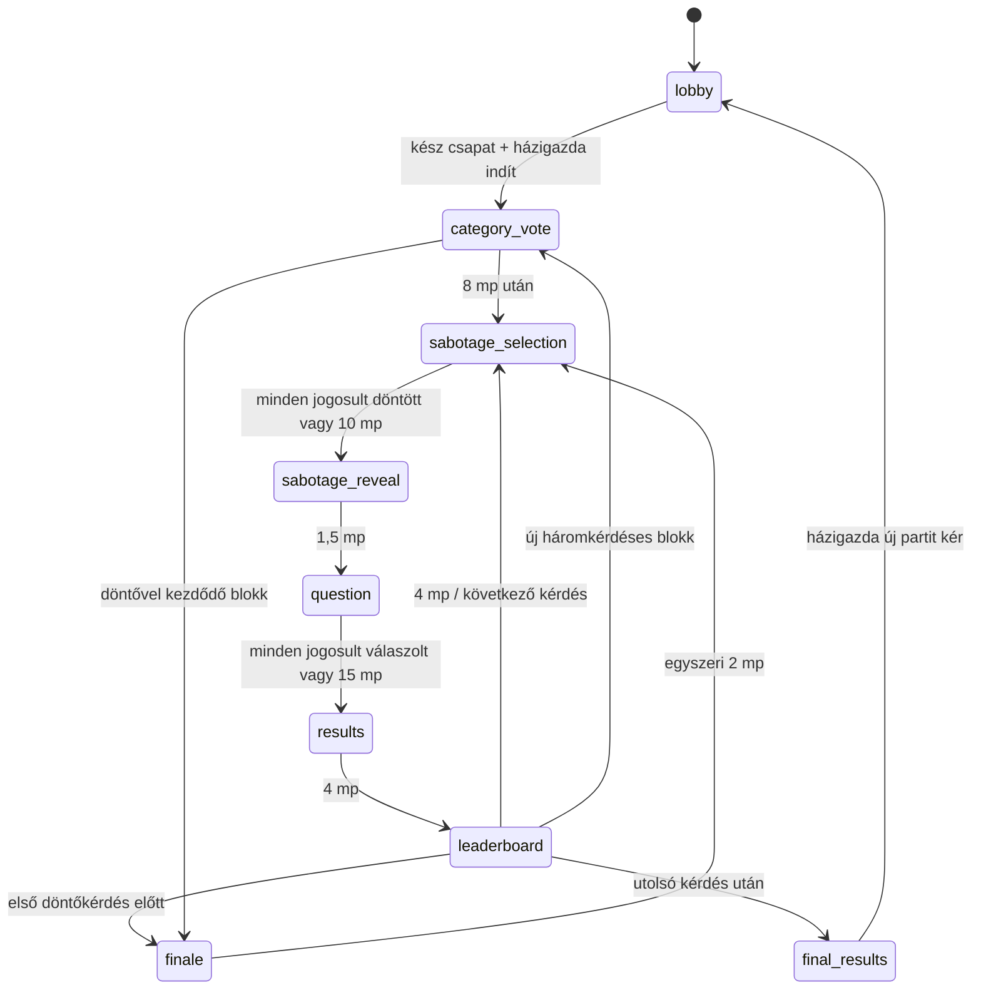

# Észvesztő – játéktervezési szerződés

## Jóváhagyott termékdöntések

- Magyar nyelvű, böngészős kvízparti 2–8 játékosnak, privát szobakóddal.
- 6, 12 vagy 18 közös kérdés, alapérték 12. Könnyed, Normál (alapérték), Nehéz.
- Háromkérdéses blokkonként három felkínált kategória közös szavazással.
- Minden kérdés után eredmény és ranglista. A végén dupla pontos döntő és végső győztesek.
- Nyolc kizárólag kozmetikai karakter: Maffiamacska, Rövidzárlat, Professzor Káosz, Züm, Krumplibáró, Paca, Galambkirály, Csonti. Azonos karaktert többen is választhatnak.
- Játékidőn kívül összeállított kérdésbank; nincs élő AI, külső trivia-API vagy fizetős tartalomszolgáltatás.
- Megvalósult szabotázsrendszer: kérdésenként egy ingyenes képesség három véletlen ajánlatból, másik játékos célzása, öncélzás tilos. Több támadás korlátozott összhatása megválaszolhatóvá hagyja a kérdést; semelyik elfogadott támadás nem tűnhet el csendben. Nincs bolt vagy fizetőeszköz.

## PR #3: ténylegesen megvalósult

Teljes szabotázs a korábbi élő előszoba, kvíz és jogosultságok megtartásával. Minden kérdés előtt három saját ajánlat, egy ingyenes támadás vagy kihagyás. A `target-selection` fenntartott protokolltípus továbbra sem külön globális fázis: a célzás a `sabotage-selection` helyi második lépése. A korábbi `session` csak régi tárolt adat kompatibilitásához marad meg.

Az inicializálás a szerver indítási tranzakciójában hozza létre a munkamenetet; nincs üres inicializáló képernyő. Az eltérő döntőhatárok miatt a döntő indulhat blokk közben (6 kérdés: 5.; 18 kérdés: 15.) vagy szavazás után (12 kérdés: 10.). Minden állapot és lezárt eredmény tartósan mentett.

## E PR-ban kiválasztott technikai alapértékek

Ezek működő implementációs döntések, későbbi termékhangolással változhatnak:

| Fázis/szabály                         | Alapérték                           |
| ------------------------------------- | ----------------------------------- |
| Kategóriaszavazás                     | 8 mp, egy módosítható szavazat      |
| Szabotázsválasztás + célzás           | közös 10 mp, egyszeri döntés        |
| Támadásbemutató                       | 1,5 mp, nincs jóváhagyó gomb        |
| Kérdés                                | 15 mp, egy zárolt válasz            |
| Eredmény                              | 4 mp                                |
| Ranglista                             | 4 mp                                |
| Döntő bejelentése                     | egyszer 2 mp                        |
| Döntő hossza 6 / 12 / 18 kérdésnél    | 2 / 3 / 4 kérdés                    |
| Helyes válasz                         | 100 + 0–50 gyorsasági pont          |
| Hibás/kihagyott/határidőn túli válasz | 0 pont                              |
| Döntő szorzó                          | 2 az alappont és a bónusz összegére |

Szavazásnál a legtöbb szavazat nyer; döntetlennél a holtversenyben állók, szavazat nélkül mindhárom ajánlat közül egyenletes kriptográfiai véletlen választ. Szavazatok játékos-ID szerint felülíródnak, nem összeadódnak. Összesített szavazatszám a határidő után nyilvános, a saját választás közben is látható. A nyertes téma a következő három kérdésre érvényes. Új ajánlat előnyben, ismétlés csak szükség esetén. Ajánlathoz legalább három még nem használt publikált kérdés szükséges.

Gyorsaság: `e = floor((szerver_beérkezés − kérdéskezdés) / 1000)`; `b = floor(50 × max(0, 14 − e) / 14)`; helyes pont `(100 + b) × szorzó`. Az első 1 mp 50, az utolsó 1 mp 0 bónuszt ad, a határidő kizáró. A szerver átvételi ideje számít, kliensóra nem; hálózati késéshez nincs rejtett kompenzáció. A kliens óraeltérés-becslést és ping/pongot használ a kijelzéshez, nem pontozáshoz.

Pontszámok halmozódnak, döntő előtt nincs nullázás. Egy kör lezárása egyszer ad jutalmat; munkamenet-, kör- és fázisazonosító köt minden szavazatot/választ az aktuális állapothoz. Ugyanazon kérés ismétlése visszaigazolható; új kérés-ID sem nyitja fel a már rögzített választ.

## A hat szabotázs és pontos alapértékei

A központi regiszter `src/shared/sabotage.ts`; az összevonás `src/server/sabotage.ts`. Az alábbiak megvalósult, kezdeti hangolási értékek, játékosokkal még nem kalibrált végleges szabályok.

| Stabil ID / magyar név         | Mechanika                                                                                                                                | Több azonos támadás                                                         |
| ------------------------------ | ---------------------------------------------------------------------------------------------------------------------------------------- | --------------------------------------------------------------------------- |
| `slime` / Takonybomba          | Organikus zöld foltok a kérdés/válaszok kis részein. Egy koppintás, kattintás vagy Enter eltávolít egy foltot.                           | `min(3, 1 + ceil(támadásszám / 2))` folt; egy támadás 2 folt.               |
| `freeze` / Fagyasztás          | Jeges keret és egyértelmű visszaszámlálás. A szerver és a kliens is tiltja az induláskori beküldést.                                     | 1/2/3/4+ támadás: 1200/1600/1800/2000 ms.                                   |
| `shuffle` / Káosz              | Tényleges, célpontspecifikus helycsere a megjelent válaszokon 650 ms-nél; 200 ms rendeződési jelzés.                                     | 2+ támadásnál még egy helycsere 1250 ms-nél. Zár feloldása 850/1450 ms-nél. |
| `upside-down` / Feje tetejére! | Csak a válaszszöveg fordul 180°-kal; kérdés, gombhely, időmérő és navigáció nem. Automatikusan visszaáll.                                | 3000 ms + 500 ms minden további támadásra, maximum 4000 ms.                 |
| `ink` / Tintapaca              | Sötét csillagszerű tinta: legalább 16 px-es rövid söprés vagy két koppintás/kattintás/Enter. Első megnyomás halványít, második eltüntet. | Ugyanaz a foltszámképlet, maximum 3 tintafolt.                              |
| `roulette` / Válaszrulett      | A válaszok 2000 ms alatt négyszer helyet cserélnek; a körforgás végén stabilak. Beküldés addig tiltott.                                  | 2+ támadásnál öt helycsere, nem hosszabb idő.                               |

A kérdés saját kezdeti válaszkeverése közös és külön történik. A szabotázs a kérdés megjelenése után módosítja a célpont sorrendjét. A szerver előre mentett, megoldókulcstól független, nem nulla eltolású válaszindex-permutációkat és abszolút időket küld. A React-gomb kulcsa és beküldött indexe végig ugyanaz a kanonikus identitás; a betűjel is ehhez kötődik. A helycserék alatt a kliens `aria-disabled` állapotot és megnyomáskor visszajelzést ad, a szerver pedig `ANSWERS_MOVING` hibával tiltja a túl korai választ. Nincs véletlenül másik válasszá változó beküldés. A feloldás pillanatára stabil az elrendezés.

### Korlátozott összevonás, minden támadás elszámolva

Minden elfogadott támadás megőrzi a támadó ID-ját, képességét, célpontját és feloldási eredményét. A célpontonkénti összesítés nem dob el és nem irányít át támadást. Típusonként csökkenő hozadék és szigorú felső korlát érvényes; a fölös mechanikai erő helyett a valós szám és teljes támadáslista marad a társas visszajelzésben.

1. Fagyasztás és mozgás párhuzamosan indul a kérdés kezdetén. A közös beküldési zár `max(fagyasztás, mozgás)`, **maximum 2000 ms**, nem ezek összege. Három Fagyasztás + két Rulett így 2 mp zár, nem 5,8 mp.
2. Káosz + Rulett együtt csak a Rulett legfeljebb öt helycseréjét futtatja; a Káosz egy további permutációval járul hozzá az utolsó, közös képkocka végső sorrendjéhez. Nem hosszabbítja a zárolást és nem indít külön mozgási sorozatot.
3. A közös zár végétől fordul fejre az esetleges válaszszöveg, legfeljebb 4 mp-ig. Közben már lehet válaszolni.
4. Ezután jelennek meg együtt a takony- és tintafoltok. Eltávolíthatók, és **4500 ms után automatikusan eltűnnek**. Közben is lehet válaszolni. A foltok legfeljebb 20% szélesek, takony 18%, tinta 16% magas; típusonként maximum három. Összes névleges befoglaló terület maximum 20,4%. A legalább 44 px-es érintési felület és legalább 280 px magas aréna a támogatott 320 px-es nézeten is a 25%-os kereten belül marad. Nem fedik le az összes választ vagy a teljes kérdést.

Legrosszabb vegyes ütemezésben az akadályok a normál 15 mp-ből legkésőbb 10,5 mp-nél elmúlnak; a beküldés legfeljebb az első 2 mp-ben tiltott. Hét támadás ugyanarra a játékosra mind megjelenik a nyilvántartásban. A határon túl érkező további támadás nem növeli a zárat, a foltszámot, a mozgásszámot vagy a fejre állítás idejét.

### Ajánlat, célzás és szerver-visszaigazolás

A szerver kriptográfiai véletlennel választ három egyedi képességet a hatból minden megmaradt résztvevőnek, minden kérdésre. Az ajánlat a kérdés kiválasztásával együtt mentett; újracsatlakozás ugyanazt kapja. Kizárólag a saját ajánlat és saját elkötelezett művelet látható választás közben. Más játékosról csak a döntés megléte nyilvános; képessége/célpontja a feloldás előtt nem.

Mobilon három nagy, eltérő színű/ikonú kártya → egy választott képesség és karakteres ellenfélrács → ellenfélre koppintás. A vissza gomb a végleges beküldés előtt enged másik képességet. A szerverállapot és a kérés visszaigazolása után jelenik meg a rögzített támadás; hiba esetén magyar üzenet és új célzási lehetőség marad. Nincs külön jóváhagyó párbeszéd. A kihagyás explicit művelet; aki 10 mp alatt nem dönt, időtúllépéses kihagyást kap. A fázis elején még türelmi időn belüli jogosultak mindegyikének döntése után a szerver korábban feloldhat; később visszatérő résztvevő addig választhat, amíg a fázis még tart. A döntő minden kérdéséhez ugyanez tartozik, egyszeri döntőbejelentés után.

Atomikus WebSocket-művelet: `attack {requestId, sessionId, phaseId, round, abilityId, targetId}` vagy `skip-attack {requestId, sessionId, phaseId, round}`. Hitelesített kapcsolati identitás, aktív résztvevő, munkamenet, fázis, kör, szerverhatáridő, saját ajánlat, másik érvényes célpont és egyetlen elkötelezett művelet kötelező. Runtime-validálás ismeretlen képességre/hibás célpont-ID-ra hibát ad. A meglévő, játékosonkénti mentett kérés-ID deduplikáció visszaigazolhatja az eredeti sikeres kérést; új ID sem enged második támadást. Mentés megelőzi a broadcastot és ACK-ot.

A feloldás egyszer fut (`resolved`), majd 1,5 mp bemutató következik kötelező kattintás nélkül. Nincs bejövő támadás: nyugodt üzenet; egy: konkrét képesség; több: valós darabszám. A kérdés kis összesítést mutat, az eredmény lenyitható részleteiben minden támadó/képesség és a saját elküldött támadás szerepel. Nincs hamis vagy eltúlozott támadásszám.

### Reconnect, kilépés és adatvédelem

Mentett: ajánlatok, elkötelezett támadás/kihagyás, jogosultsági pillanatkép, célpontok, minden támadásrekord, egyszeri feloldás jelzője, típusonkénti számok, képkockák és abszolút hatás-határidők. Ezek rekonstrukciókor nem generálódnak újra. A fagyasztás a szerver kérdéskezdésétől számít, kliensidő nem fogadható el. `FROZEN` visszautasítás nem rögzít választ, nem hosszabbítja a kérdést, nem módosít pontot. A már elfogadott válasz frissítéskor is zárolt.

Rövid ideig offline ellenfél célpont lehet. A 90 mp türelmi időn túli vagy kifejezetten kilépett ellenfél új támadás célpontja nem lehet. Már rögzített támadás célpontjának átmeneti kapcsolatvesztése nem törli/irányítja át azt, határideje offline is fut. A feloldás előtt kifejezetten kilépett célpont támadása `target-left` eredménnyel megmarad, mechanikai hatás nélkül. Feloldás után kilépés nem írja át a történeti feloldást. A támadó utólagos kapcsolatvesztése vagy kilépése nem vonja vissza a rögzített támadást. Korábbi pontok és rangsor a meglévő szabály szerint maradnak. Új parti törli az egész kvízzel együtt az összes ideiglenes szabotázst; új session/phase védi a visszajátszás ellen.

A folttörlés vizuális előrehaladása ugyanazon böngésző helyi tárában, játékos/fázis szerint mentett; más eszközre nem szinkronizált és tiltott tárnál csak az aktuális nézetben őrizhető meg. Az abszolút lejárat akkor sem indul újra. A szerver hiteles játékszabályt és zárolást biztosít, a kliens vizuális hatását nem állítjuk manipulálhatatlannak.

Csak saját hatásütemezés és a már feloldott saját bejövő/kimenő támadások kerülnek a néző projekciójába. Reconnect-titok, hash, más ajánlat, más elkötelezett művelet, teljes bank és idő előtt megoldókulcs nem. A hatáspermutáció nem tartalmaz helyességi adatot; rejtett HTML-attribútum sem tartalmaz megoldást.

## Tartalom és mintavétel

120 magyar, négyválaszos szöveges kérdés, 12 kategóriában, kategóriánként 3 könnyű, 4 közepes, 3 nehéz. A bank a szervercsomag része. Stabil ID, típus, kategória, nehézség, szöveg, opciók, megoldókulcs, magyarázat, `published` állapot és strukturális ellenőrzési/provenienciajelölés. Az importáláskori validálás hibás struktúránál megállítja a build/futtatást.

Célminták három kérdésenként: Könnyed = könnyű/könnyű/közepes; Nehéz = közepes/nehéz/nehéz; Normál az első félidőben könnyű/közepes/nehéz, a másodikban közepes/nehéz/nehéz. A 18 kérdéses Normál első fele kilenc kérdés, nem egy teljes félidőre kerekített blokkszám. A mintavétel kategorikus marad, nincs csendes témacsere.

Először a partiban még nem használt, előző partikból megjegyzett legfeljebb 60 ID-n kívüli készlet, ha létezik; utána a kért nehézség. Hiányzó szint determinisztikus helyettesítési sorrendje: könnyű → közepes → nehéz; közepes → könnyű → nehéz; nehéz → közepes → könnyű. Az adott szinten véletlen választás. Ha minden elérhető kérdés korábbi partiból ismert, ismét használható, de **ugyanazon partin belül soha nincs ismétlődő ID**. Az új kérdések előnyben részesítése ezért felülírhatja az ideális nehézségi arányt.

Kezdő készlet: általános, többnyire állandó tények, automatikus szerkezeti ellenőrzéssel. **Nem volt független emberi audit vagy empirikus nehézségkalibráció.** A témánkénti forrásmutatók szerkesztői kiindulópontok, nem minden állítás ellenőrzött idézetei. A review értéke `automated-structure-only`. A „published” a játékba engedett struktúrát jelenti, nem emberi tanúsítást. Tételes forrásellenőrzés, szerkesztés és játékosokkal mért besorolás szükséges a tartalom következő fejlesztéséhez.

A megosztott modell megőrzi az igaz/hamis és képes kérdéseket; a motor kétopciós igaz/hamis projekcióra és képmetaadatra felkészített. A publikált tartalomkapu jelenleg csak négyopciós szöveges típust fogad. Képes tartalom jóváhagyott saját assetekig zárt; nincs külső képletöltés vagy előállított karakterkép.

## Eredmények és rangsorolás

Eredményképernyő: helyes válasz, saját választás/kihagyás, alappont, bónusz, szorzó, valódi körpont, magyarázat. A következő ranglista összpontokat, karaktert, becenevet, saját kiemelést és valódi helyezésváltozást mutat. Kérdés alatt nincs teljes ranglista.

Azonos pontszámhoz azonos versenyhelyezés tartozik (1., 1., 3.). Stabil megjelenítési sorrend: pontszám csökkenően, belépési idő, ID. A végén minden első helyezett győztes. Pontosság helyes / összes kérdés, tehát kihagyott kérdés is a nevező része. Átlagos válaszidő csak tényleges, határidőn belüli válaszokból; hibás válasz is beleszámít. Nem készítünk hamis statisztikát.

## Megbízhatóság és aktív részvételi szabály

Egy Durable Object vezérli a szobát, sorosított tranzakciókkal és tartós határidőkkel. A legközelebbi játék-, heartbeat-, türelmi- vagy lejárati határidőre egy közös alarm figyel. Késői alarm az eredeti határidők mentén léptet több fázist; nem indít újra időzítőt és nem jutalmaz kétszer. A parti zárt böngészők mellett is befejeződik.

Frissítés helyreállítja az aktuális fázist, hátralévő időt, saját zárolt választ és pontszámot. Nyilvános projekcióban nincs megoldókulcs a lezárás előtt, nincs más játékos választása, belső válaszidő vagy kérdésbank-metaadat. A szerver kapcsolatonként készít biztonságos, saját választást tartalmazó projekciót. A kliens nem dönt átmenetről vagy pontozásról.

Az előszobában változatlan 90 másodperces türelmi idő és eltávolítás. Aktív játékban a régi identitás és eredménye megmarad a szobakor végéig: 90 másodperc után házigazdaátadás történhet, a játékos nem blokkolja a korai lezárást, de visszatérhet. Az aktuális, még megválaszolatlan kérdésre időben visszatérve válaszolhat, már mentett választ nem módosíthat. Egy offline játékos sem fagyasztja meg a 15 másodperces határidőt.

Kifejezett kilépő történeti pontjai/rangsora megmaradnak, visszalépési jogosultsága megszűnik. Új parti csak a végeredmény után, házigazdai műveletből: előszoba, új készenlét; az új indítás új munkamenet. Karakter és beállítás marad, pont és válasz törlődik. Türelmi időn túl továbbra is offline helyek új partinál felszabadulnak. Új játékos csak előszobában csatlakozhat.

## Cloudflare kompatibilitás és ismert korlátok

Worker név/éles bindings/SQLite `v1` változatlan. A `room` rekord additív `schemaVersion: 3` bővítést kap. A 2-es séma előszobája és aktív kvíze, identitásai, beállításai, pontjai, kérdésfolyamata, válaszai, fázisazonosítója és határideje megmaradnak; hiányzó `sabotage` mező `null`. Futó régi kérdésre nem alkalmazunk utólag új hatást, a következő kérdés már szabotázzsal kezdődik. Régi előszoba megmarad, az első PR régi kérdés nélküli `session` egyszer visszatér előszobába magyar tájékoztatóval és törölt készenléttel; belépési titok hash, karakter és beállítás megmarad. Nincs destruktív adat- vagy infrastruktúra-migráció. Tartalomkiadáskor stabil ID-k megőrzése szükséges aktív partira hivatkozó tartalomhoz.

A feature ág Workers Builds folyamata `wrangler preview` parancsot futtat. Ehhez a `previews.durable_objects.bindings` újra deklarálja az `env.ROOMS` bindingot helyi `Room` osztállyal, külső `script_name` nélkül: a Cloudflare automatikusan külön névteret és tárolást ad preview-nként. A `previews.ratelimits` ugyanazt a 60 kérés / 60 mp korlátot a külön `1002` névtérben használja, az éles `1001` változatlan. A preview-k rate-limit névtere közös, az éles forgalomtól elkülönített. Az assetek és a meglévő migráció öröklődnek a felső szintről. Ez az előnézeti build konfigurációja, nem éles telepítés. [Cloudflare izolációs szabályok](https://developers.cloudflare.com/workers/previews/resources/#durable-objects).

Ismert korlátok: kis kezdő bank, előzetes nehézségcímkék, témánkénti forrásmutatók, hálózati késés hatása, mobil háttérbe kerülés miatti kapcsolatvesztés, eredethez kötött böngészőtár, Cloudflare szolgáltatási kvóták. A korábbi 2 órás tétlenség és 24 órás szobakor továbbra is érvényes. Teszt és deploy dry run helyi; éles Cloudflare-telepítést ez a PR nem végez.

## Mobil, hozzáférhetőség és ellenőrzés

320/375/390/430 px és asztali nézet; legalább 44 px érintési célok, safe-area margók, tördelődő becenevek. Kis helyen hosszú szöveg/célpontrács görgethető, nem levágott. Egyetlen meglévő játékóra rajzolja a visszaszámlálást és a határidős hatásokat; nincsenek hatásonként új intervallumok vagy nehéz canvas/animációs csomagok. CSS/SVG és natív gombok. Billentyűzetes törlés és két megnyomás a tinta söprésének alternatívája. `prefers-reduced-motion` kikapcsolja az erős animációt; azonos helycserék, időzárak, rövid fejre állítás és törlési feladat marad. Nincs villogás; szöveg/ikon jelzi az állapotot, nem csak szín.

PR #3: 85 sikeres Vitest szabály- és valódi Workers-teszt; az előző tesztek megmaradtak. Ajánlatok/privát projekció, atomikus validálás, kihagyás/időtúllépés, stale phase/session/round, 2/4/8 résztvevő, hét elfogadott támadás ugyanarra a játékosra, mind a hat mechanika, csökkenő hozadék és korlátok, helyes válaszindex, szerveroldali fagyasztás, disconnect/kilépés, tárolási upgrade, rekonstrukció, késői alarm, pontozás, döntő és új parti.

A nyolcklienses Workers-teszt valódi HTTP/WS belépéssel, támadás/ACK újraküldéssel, reconnecttel és Durable Object rekonstrukcióval mind a hat típust célozza egy játékosra. A teszt saját tárolt fixture-jében rögzített ajánlatok és határidők vannak, nincs éles tesztkapu vagy hamis eredmény. A szerver visszautasítja a fagyott választ, majd mind a nyolc résztvevő helyes választ ad és valódi pontot kap.

Három sikeres Chromium-teszt: előszoba/jogosultságok, főoldal, továbbá két független érintéses mobilkliens hat valódi kérdéssel. Utóbbi választ/céloz, ténylegesen kiosztott hatásokat kezel, helyes pontszámot és indexet ellenőriz, ajánlat/támadás/folttörlés/válasz közben frissít, egyszeri döntőt és új partit vizsgál. Az egyik kliens csökkentett mozgású. A véletlen ajánlatokat nem cseréli le a browserteszt; minden képesség determinisztikus szabálytesztben is lefedett. Keskeny mobilképek a teszt artifactjaiban. ESLint, TypeScript, build, E2E és Wrangler deploy dry run eredménye a PR leírásában; helyi Workers-validálás nem bizonyít éles deployt vagy valós telefonon végzett emberi tesztet.

## Következő ajánlott mérföldkő

Külön tartalmi és vizuális finomítás: tételes kérdésbank/forrásellenőrzés, nehézségkalibráció, célzott mobil olvashatóság és valós csoportokkal a most dokumentált szabotázsértékek hangolása. Ezek jövőbeli javaslatok. Bolt, pénznem, új karakter, fiók és fizetős szolgáltatás továbbra sem része a megvalósításnak.
